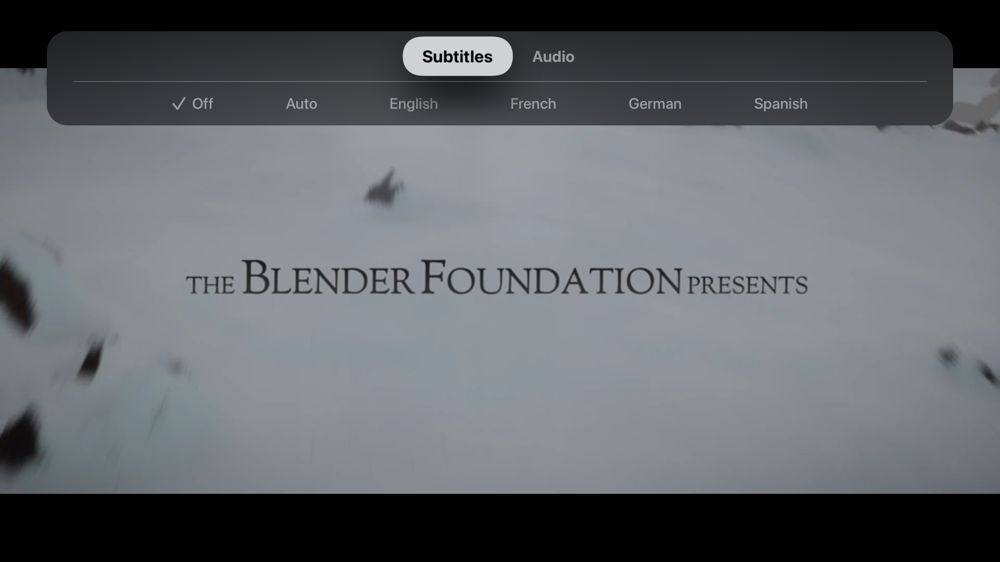
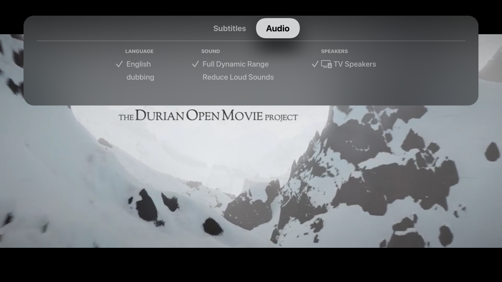
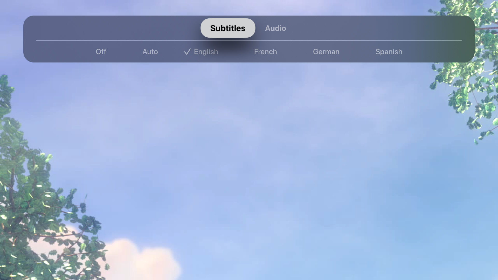
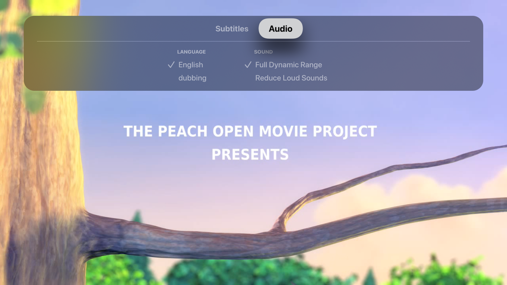
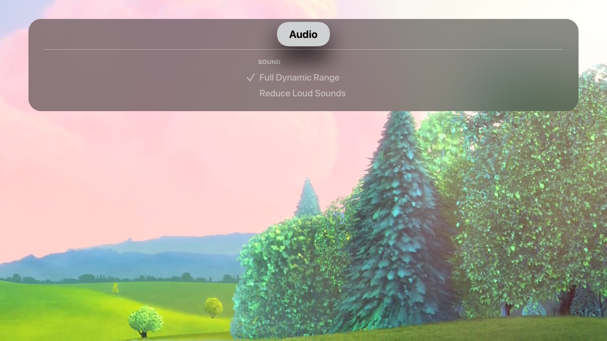
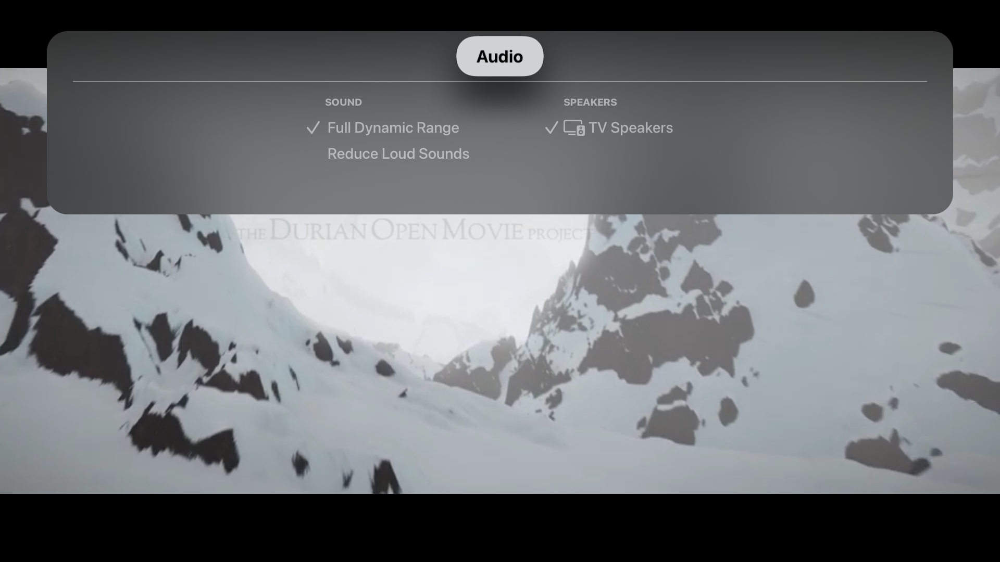
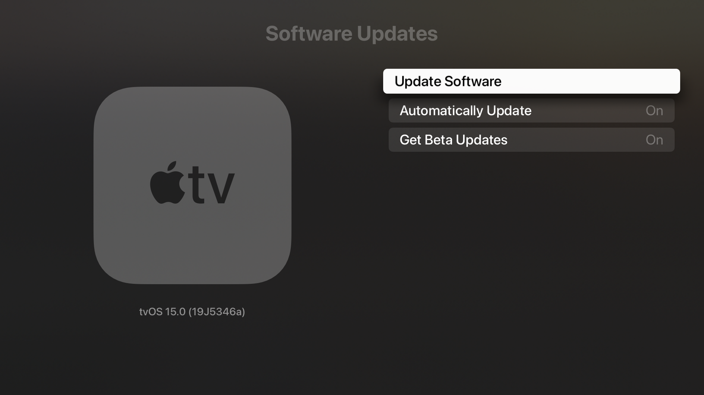
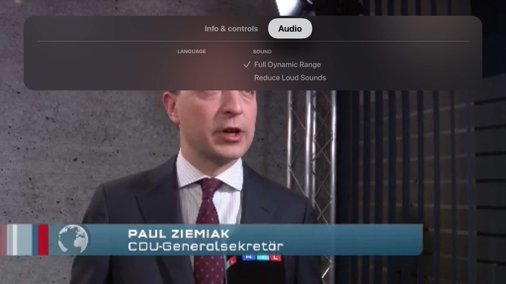
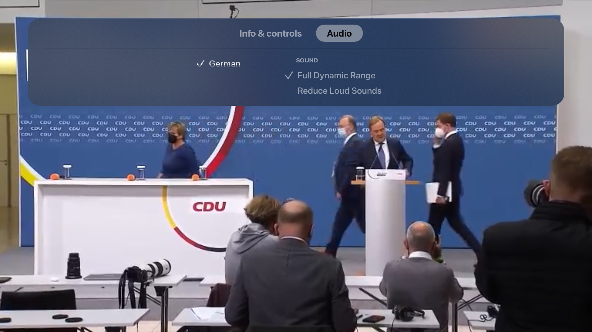

# tvOS 15 beta 9 (19J5346a) AVPlayerViewController has incorrect Subtitle & Audio tracks

Feedback Assistant: [9622412](https://feedbackassistant.apple.com/feedback/9622412)

When AVPlayerViewController is reused, the Subtitle & Audio track UI always shows the initial stream data. The subtitle & audio track UI in the top tab bar does not update when a new streams is started. This bug is unique to apps built with a version of Xcode older than Xcode 13, i.e., Xcode 12.5 (12E262), but running on an Apple TV device with tvOS 15.

In this use case the app uses the pre-tvOS 15 player UI, where subtitles and audio tracks are in the top tab bar. The behavior is not reproducible if the app is running on an Apple TV device with tvOS 14.7.

For example, suppose a stream with a German audio track is started. In that case, a new stream is started with an English audio channel using the same AVPLayerViewController, then the Audio tab will still show "German" and not "English."

## Steps to reproduce:

This behavior is reproducible when reusing an AVPlayerViewController. The app needs to be built using **Xcode 12.5** and installed on a device with **tvOS 15**.

1. Build, archive, and export an app on Xcode 12.5.
2. Install the app using Xcode, TestFlight or Apple Configurator 2 on an Apple TV with tvOS 15.
3. Open the app and present the AVPlayerViewController with a stream that has subtitles & audio tracks.
4. Swipe down and note the different subtitles & audio tracks. The user can switch subtitles & audio tracks successfully.

| Stream 1 - Correct subtitle track | Stream 1 - Correct audio track |
| ---            | ---
|||

5. Press the menu to dismiss the AVPlayerViewController.
6. Using the same AVPlayerViewController, replace the AVPlayer with a new instance that uses a stream with no subtitle & audio tracks. Present the AVPlayerViewController.
7. Swipe down and note that the subtitle & audio tracks are incorrect and are the same as the stream started in Step 1. Selecting the subtitle or audio track does nothing.

| Stream 2 - Wrong subtitle track | Stream 2 - Wrong audio track |
| ---            | ---
|||

| Stream 2 - Expected media track |
| ---            |
||

The order in which stream is played first matters: If a stream with no subtitles & audio track starts first, then the 2nd stream will also have no subtitles & audio tracks, even if it should.

| Stream 1 - Incorrect audio track |
| ---    
||

The expected behavior is that when a new instance of AVPlayer is assigned to the player property of AVPlayerViewController, then the subtitle & audio UI represents the correct data for that stream.

#### Os version


## Workaround 1: Replacing the AVPlayerItem instead of AVPlayer
The issue of the media option tracks being incorrect when replacing the `AVPlayer` is not reproducible if the `AVPlayer` is reused and the `AVPlayerItem` is replaced. However, the audio options layout is incorrect. Depending on the audio options, the UI may have an empty list or the list is cut off. See [comment](https://github.com/cgoldsby/FB9622412_IncorrectMediaTracks/blob/e5690a0d6c74827709c38dd107ed3ae73929ba39/FB9622412_IncorrectMediaTracks/ViewController.swift#L33).

| Stream 2 - Language options should not be present|
| ---            |
||

In the following screenshots the test stream has two available languages: german and english. The list of audio languages appear to be empty but the user can change focus the items and scroll through the list. When the audio languages are focused the list is cut off.
| Test Stream - Language options cut off | Test Stream - Language options have focus but are cut off |
| ---            | ---
|||

When implementing the "workaround 1" solution in a production app there was a [mysterious crash](https://github.com/cgoldsby/FB9622412_IncorrectMediaTracks/blob/main/crash/Zattoo_2021-09-21-073133_Christophers-MacBook-Pro.crash) that occurred a few times but is not easy to reproduce.

[Crash log](https://github.com/cgoldsby/FB9622412_IncorrectMediaTracks/blob/main/crash/Zattoo_2021-09-21-073133_Christophers-MacBook-Pro.crash)
```
Thread 0 Crashed:: Dispatch queue: com.apple.main-thread
0   libobjc.A.dylib               	0x00007fff200923d7 objc_msgSend + 23
1   libobjc.A.dylib               	0x00007fff200aa0a5 objc_getProperty + 72
2   com.apple.AVKit               	0x00007fff35a569ff -[AVNowPlayingPlaybackControlsViewController infoPanelViewController:willShowViewController:] + 57
3   com.apple.AVKit               	0x00007fff359d356e -[AVInfoPanelViewController infoMenuController:didSelectViewController:] + 82
4   com.apple.AVKit               	0x00007fff35a255b9 __60-[AVInfoMenuController transitionSelectionFrom:to:animated:]_block_invoke + 507
5   com.apple.AVKit               	0x00007fff359ea758 __100+[AVInfoMenuTransitioningAnimation infoPanelTransitioningAnimationFrom:to:containerView:completion:]_block_invoke.66 + 396
6   com.apple.UIKitCore           	0x00007fff4dbe4f0d -[UIViewPropertyAnimator _executeCompletionHandlerWithFinalPosition:] + 226
7   com.apple.UIKitCore           	0x00007fff4dbe5002 -[UIViewPropertyAnimator _runCompletions:finished:] + 118
8   com.apple.UIKitCore           	0x00007fff4dbe3cf3 __61-[UIViewPropertyAnimator _setupAssociatedViewAnimationState:]_block_invoke + 168
9   com.apple.UIKitCore           	0x00007fff4eb84e56 -[UIViewAnimationBlockDelegate _didEndBlockAnimation:finished:context:] + 779
10  com.apple.UIKitCore           	0x00007fff4eb564d8 -[UIViewAnimationState sendDelegateAnimationDidStop:finished:] + 231
11  com.apple.UIKitCore           	0x00007fff4eb56a7d -[UIViewAnimationState animationDidStop:finished:] + 263
12  com.apple.UIKit.axbundle      	0x00007fff3d7f1ddb -[UIViewAnimationStateAccessibility animationDidStop:finished:] + 195
```
